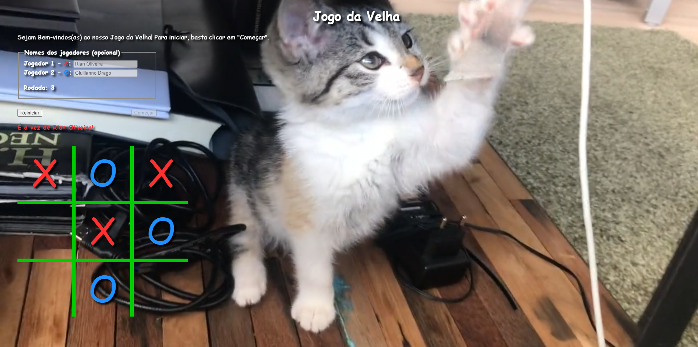

<h1 align="center">Jogo da Velha</h1>

## Sobre o Projeto

Jogo da Velha simples. Projeto feito como trabalho da faculdade. Pretendo refazê-lo com um código mais limpo e legível.

## Layout

## Tecnologias utilizadas

### Front-end (apenas)

</img>
 
</img>
 
</img>

## Pré-requisitos

* Navegador (ex: [Google Chrome](https://www.google.com/intl/pt-BR/chrome/))

## Desenvolvido em

4 de jul. de 2021

<strong>Novas features em Breve!<strong>

Made with 💙 by Rian Dias de Oliveira
